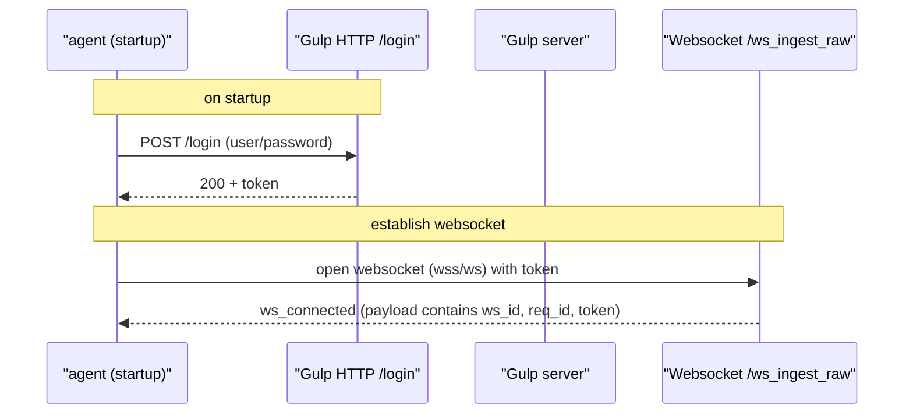
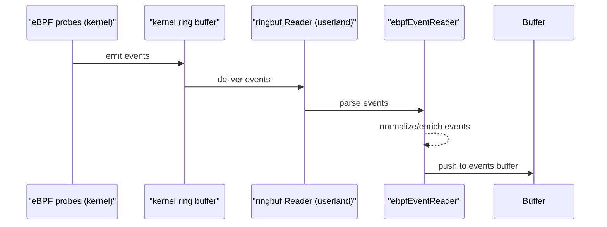
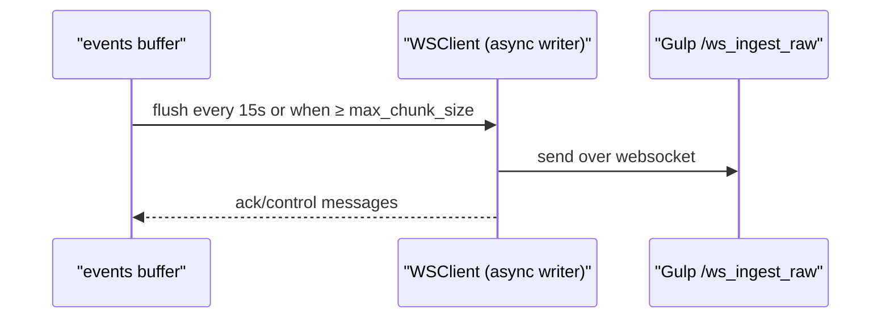

# slurp-ebpf

slurp-ebpf is a small agent that reads kernel events via an eBPF program, buffers them in user-space and forwards them to the [gulp](https://github.com/mentat-is/gulp) `/ws_ingest_raw` websocket endpoint. 

The agent batches events and sends them either when the buffer reaches a configured maximum size (`max_chunk_size`) or periodically (every 15 seconds), whichever comes first.

## Architecture

### Handshake (login & websocket acknowledgement)

first, the agent authenticates to the gulp server over HTTP and retrieves a token. then it establishes a websocket connection to the `/ws_ingest_raw` endpoint using the token for authentication.



### Event capture

the agent then attaches the requested eBPF probes to the kernel tracepoints and starts reading events from the ring buffer.




### Transport & delivery

then, the agent flushes the buffered events to the gulp server over the established websocket connection, either when the buffer reaches `max_chunk_size` or every 15 seconds.




**Prerequisites**

- Linux with eBPF support (kernel >= 4.19 recommended)
- root or CAP_SYS_ADMIN to load programs
- Go toolchain (1.20+)

## Build

build the Go binary and the eBPF object. the repo provides a small helper to build the eBPF program.

```bash
# build eBPF object (uses clang/llc in the environment)
cd ebpf
./build_ebpf.sh

# build the go binaries
go build -o slurp-ebpf ./cmd/slurp-ebpf
```

> by default, the agent will load `slurp_ebpf.o` in the current directory (use config `bpf_object` to override the path).

```bash
# or, build and run in one step, -debug enables verbose logging
./build_and_run.sh --debug
```

## Configuration

example `slurp_cfg.json` (the repo includes a sample):

```json
{
  "gulp": {
    "uri": "http://localhost:8080",
    "username": "ingest",
    "password": "ingest",
    "operation_id": "test_operation"
  },
  "max_chunk_size": 1000,
  "hooks": ["sys_enter_execve"]
}
```

- `max_chunk_size`: maximum number of events sent in a single websocket packet (default 1000)
- `gulp.uri`: http/s address of the gulp server
- `gulp.username`: username
- `gulp.password`: password
- `hooks`: list of hooks (tracepoint short-names or full sections) to attach, supported hooks:
    - `sys_enter_execve` : traces process execve calls (process creation)
    - `sys_enter_connect` : traces socket connect calls (outgoing connections)
    - `sys_enter_accept` : traces socket accept calls (incoming connections)
  
- `bpf_object` (optional): path to the compiled eBPF object; defaults to `./slurp_ebpf.o`

TLS / Client certificates

The agent supports HTTPS/WSS connections using client certificates (PEM format). The following fields are available under the `gulp` section of the configuration:

- `gulp.cert_file`: path to client certificate (PEM). default: `./certs/client.crt`
- `gulp.key_file`: path to client private key (PEM). default: `./certs/client.key`
- `gulp.ca_cert_file`: path to CA certificate (PEM) used to verify the server. default: `./certs/ca.crt`
- `gulp.use_self_signed`: boolean, when `true` the agent will allow connections to servers using self-signed certificates (skips verification).

If the certificate files are present they will be used automatically for both the HTTP login request and the `wss` websocket connection. To connect to a server using a self-signed certificate, set `gulp.use_self_signed` to `true`.

Example (with client certs):

```json
{
  "gulp": {
    "uri": "https://gulp.example.com",
    "username": "ingest",
    "password": "ingest",
    "operation_id": "test_operation",
    "cert_file": "./certs/client.crt",
    "key_file": "./certs/client.key",
    "ca_cert_file": "./certs/ca.crt",
    "use_self_signed": false
  }
}
```

## Run

the agent accepts a `--config` path and `--debug` flag.

```bash
# run (requires root to load eBPF programs), uses configuration from slurp_cfg.json (by default, it loads the default configuration file slurp_cfg.json in the current directory)
sudo ./slurp-ebpf --config ./slurp_cfg.json

# also enables debug logging
sudo ./slurp-ebpf --config ./slurp_cfg.json --debug
```

the agent will authenticate to the configured Gulp server, connect over WebSocket, attach the requested eBPF hooks and start sending event chunks. press `Ctrl-C` to stop — the agent will send a final chunk before exiting.

