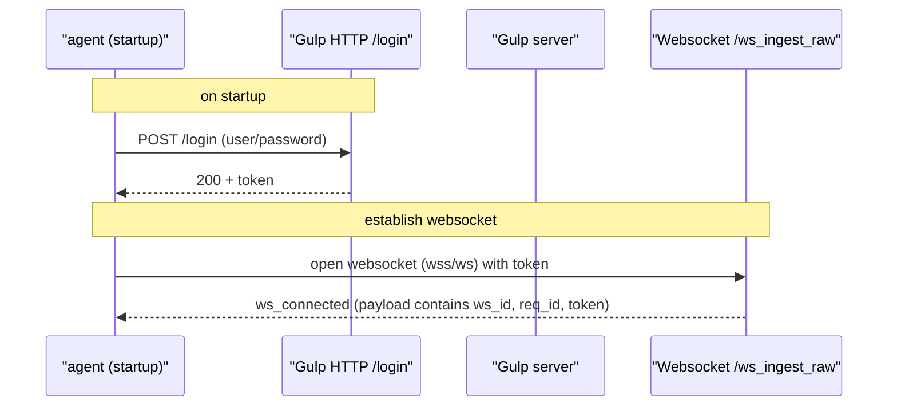
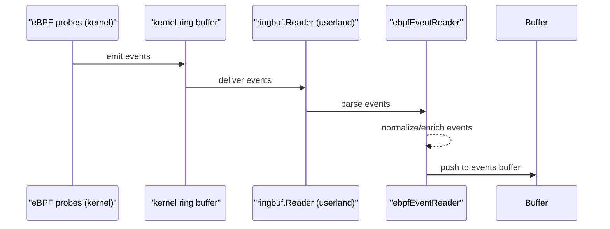
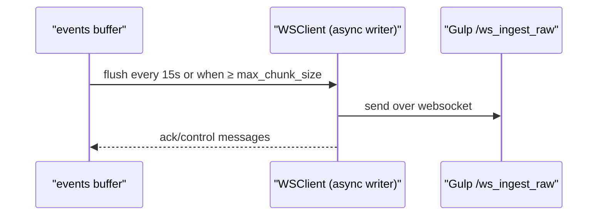

# slurp-ebpf

slurp-ebpf is a small agent that reads kernel events via an eBPF program, buffers them in user-space and forwards them to the [gulp](https://github.com/mentat-is/gulp) `/ws_ingest_raw` websocket endpoint.

The agent batches events and sends them either when the buffer reaches a configured maximum size (`max_chunk_size`) or periodically (every 15 seconds), whichever comes first.

## Scope

this is meant to be used during a running incident response or red team engagement to capture process execution and network connection events in realtime with minimal setup, to pinpoint suspicious activity as it happens and then analyze it in gulp.

**it is not intended to be a full-featured long-term monitoring agent.**

## Architecture

### Handshake (login & websocket acknowledgement)

first, the agent authenticates to the gulp server over HTTP and retrieves a token. then it establishes a websocket connection to the `/ws_ingest_raw` endpoint using the token for authentication.



### Event capture

the agent then attaches the requested eBPF probes to the kernel tracepoints and starts reading events from the ring buffer.




### Transport & delivery

then, the agent flushes the buffered events to the gulp server over the established websocket connection, either when the buffer reaches `max_chunk_size` or every 15 seconds.



**Prerequisites**

- Linux with eBPF support (kernel >= 4.19 recommended)
- root or CAP_SYS_ADMIN to load programs
- Go toolchain (1.20+)

## Build

build the Go binary and the eBPF object. the repo provides a small helper to build the eBPF program.

```bash
# build eBPF object (uses clang/llc in the environment)
cd ebpf
./build_ebpf.sh

# build the go binary (sets the embedded version to 1.0.0, remove to not embed)
BUILD_VERSION=1.0.0 ./build.sh
```

> by default, the agent will load `slurp_ebpf.o` from `$HOME/.config/slurp`.

```bash
# or, build and run in one step, --debug enables verbose logging
# will use default SLURP_CONFIG_DIR as $HOME/.config/slurp
BUILD_VERSION=1.0.0 ./build_and_run.sh --debug
```

## Configuration

configuration must be provided in `$GULP_CONFIG_DIR/slurp_cfg.json`, defaults to `$HOME/.config/slurp/slurp_cfg.json` if not found (a default file will be created).

an [example commented configuration file is provided](./slurp_cfg_template.json)

## Run

```bash
# run the agent (requires root), also enable debug logging
sudo ./slurp-ebpf --debug
```
